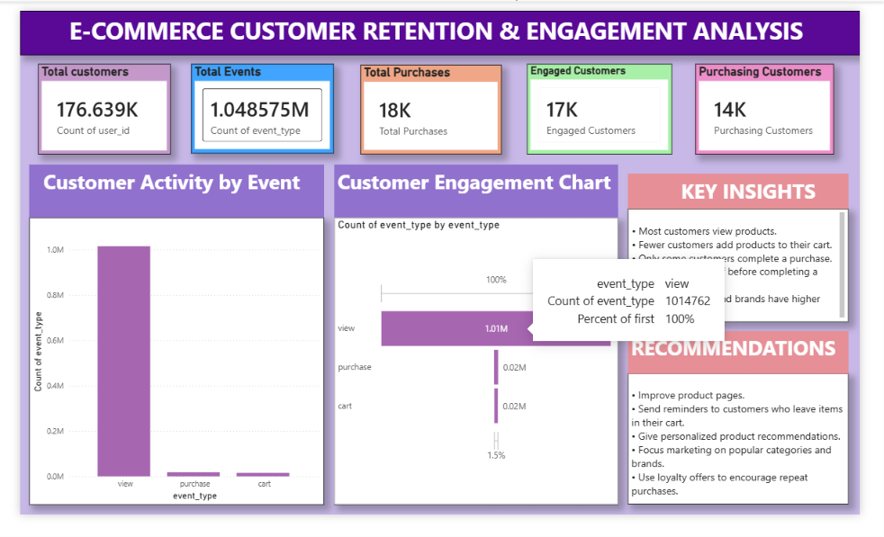
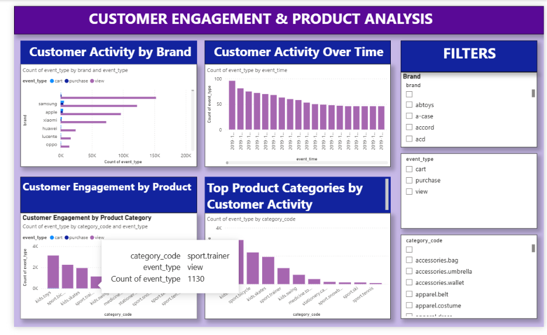

# FUTRE_DS_02
E-Commerce Customer Retention &amp; Engagement Analysis

## Project Objective:

The objective of this project is to analyze customer engagement and purchasing behavior in an e-commerce platform. This dashboard helps understand how customers interact with products, identify where they drop off before making a purchase, and provide business recommendations to improve customer retention and conversions.

## Tools Used:

Power BI
Microsoft Excel
Power Query
DAX (Data Analysis Expressions)
Dashboard Features

## The dashboard includes:

KPI Cards showing Total Customers, Total Events, Total Purchases, Engaged Customers, and Purchasing Customers.
Customer Engagement Funnel to analyze the customer journey from product views to purchases.
Customer Activity by Event Type.
Top Product Categories by Customer Activity.
Daily Customer Activity Trend.
Customer Engagement by Product Category.
Top Performing Brands.
Interactive Filters for Brand, Event Type, and Product Category.

## Key Insights:

Most customers visit and browse products, but only a small percentage complete a purchase.
A significant customer drop-off occurs between adding products to the cart and completing the purchase.
Electronics and Clothing are the most popular product categories.
Samsung, Apple, and Xiaomi generate the highest customer engagement.
Customer activity changes throughout the month, indicating seasonal purchasing behavior.
Personalized marketing strategies can improve customer retention.

## Business Recommendations:

Improve product pages to encourage more customer engagement.
Reduce cart abandonment through reminder emails and promotional offers.
Provide personalized product recommendations based on customer behavior.
Focus marketing campaigns on high-performing brands and product categories.
Introduce loyalty programs to increase repeat purchases.
Continuously monitor customer engagement to optimize marketing strategies.

## Dashboard Preview

### Page 1 – Executive Dashboard

---

### Page 2 – Customer Engagement & Product Analysis

## Project Files:

Power BI Dashboard: Ecommerce_Customer_Retention_Engagement_Analysis.pbix
Dashboard Screenshot: Dashboard_Screenshot.png
Dataset: Ecommerce_Dataset.csv

## Skills Gained:

During this project, I improved my skills in:

Data Cleaning
Data Modeling
DAX Calculations
Dashboard Design
Customer Analytics
Marketing Analytics
Business Intelligence
Data Visualization
KPI Reporting

## Conclusion:

This project provided practical experience in analyzing customer behavior and engagement using Power BI. The dashboard transforms raw customer data into meaningful business insights that help organizations improve customer retention, increase conversions, and make data-driven marketing decisions.
